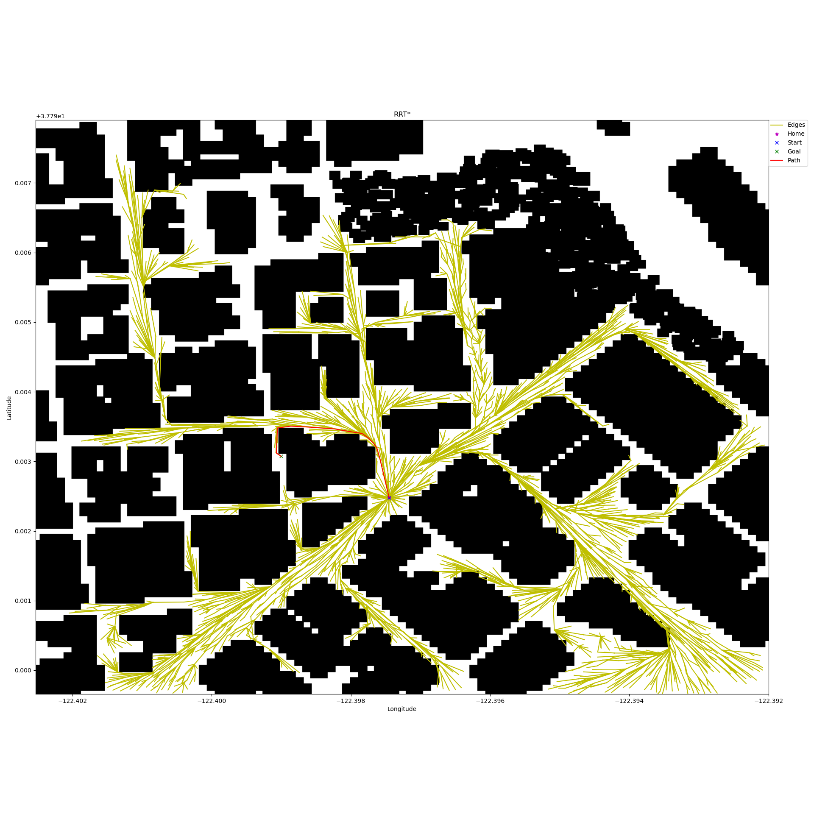
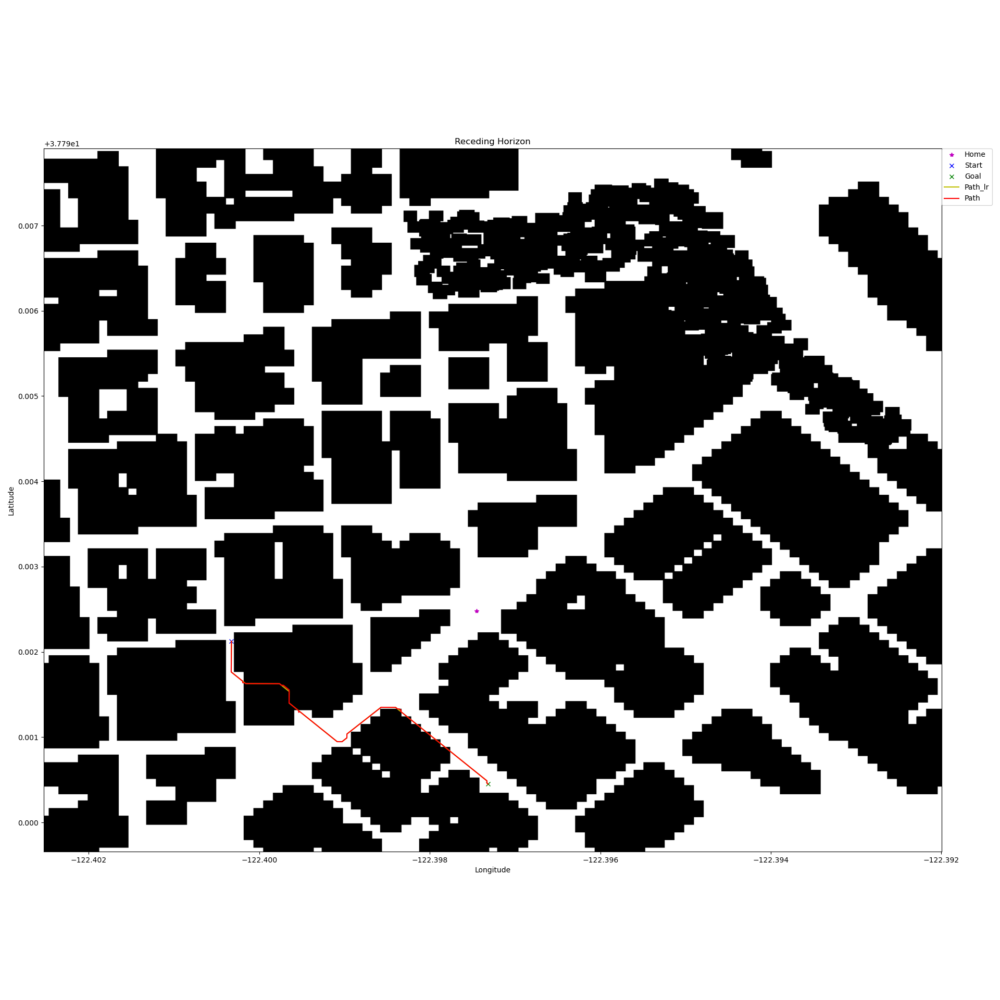

## Project: 3D Motion Planning


---


## Overview  
This project is a continuation of the Backyard Flyer project where you executed a simple square shaped flight path. In this project you will integrate the techniques that you have learned throughout the last several lessons to plan a path through an urban environment.

## Setup Instructions
### Simulator
Download the Motion-Planning simulator for this project that's appropriate for your operating system from the [simulator releases respository](https://github.com/udacity/FCND-Simulator-Releases/releases).

### Setup Python Environment
1. Install [miniconda](https://repo.anaconda.com/miniconda/Miniconda3-4.3.14-Windows-x86_64.exe) on your computer
2. Setup FCND environment

   a. Get Udacity Started Kit

      ```
      git clone https://github.com/udacity/FCND-Term1-Starter-Kit.git  
      cd FCND-Term1-Starter-Kit
      move meta_windows_patch.yml meta.yml 
      ```
   b. Create a new conda environment

      ```
      conda env create -f environment.yml
      ```
      NOTE: If the above command fails due to internet issues or timed out HTTP request then remove the partially built environment using the following command (then run the above create command again):

      ```
      conda env remove -n fcnd
      conda env create -f environment.yml
      ```
   c. Verify that fcnd environment was created in your environments

      ```
      conda info --envs
      ```
   d. Cleanup downloaded libraries (remove tarballs, zip files, etc)

      ```
      conda clean -tp
      ```

   e. Activate the environment

      ```
      source activate fcnd
      ```

   f. To uninstall environment

      ```
      conda env remove -n fcnd
      ```

   g. Instlal yaml package

      ```
      pip install pyyaml
      ```

## Project Description
1. The main script to run path planning is run.py.

       python run.py -h
       usage: run.py [-h] --cfg CFG [--method METHOD] [--grid_goal GRID_GOAL GRID_GOAL]

       optional arguments:
        -h, --help            show this help message and exit
        --cfg CFG             path to config
        --method METHOD       Motion Planning type:
                              grid/med_axis/voronoi/prob_map/vox_map/reced_horz/rrt
        --grid_goal GRID_GOAL GRID_GOAL GRID_GOAL
                              [Longitude, Latitude, Altitude],
                              Valid Range of Lon: [-122.40252691769419, -122.39199921652319], 
                              Valid Range of Lat: [37.789657716737906, 37.79790491440714] ```

2. Format of config file
      ```
      common_p:
        seed: 359             # Random seed for reproducibility
        port: 5760
        host: 127.0.0.1       # Host address, i.e. '127.0.0.1
        safety_dist: 5
        target_altitude: 5
        debug_algo: False     # Run only motion planning without simulator env
        offline_mp: False     # Run motion planning outside of drone thread for speedup vs inline path planning

      # Various Algo parameters
      grid:
        h_type: norm          # Heuristics type: norm/manh

      med_axis:
        h_type: norm          # Heuristics type: norm/manh

      prob_map:
        n_nodes: 10000        # No of random nodes
        n_neigh: 10           # No of nearest neighbors to check for connectivity in graph creation
        kd_query: nn          # rad: Query KDTree for neighbors within radius, nn: Query KDTree for k nearest neighbors
        kd_neigh: 5           # Query KDTree for 'kd_neigh' nearest neighbors

      vox_map:
        h_type: norm          # Heuristics type: norm/manh
        voxel_size: 5

      reced_horz:
        h_type: norm          # Heuristics type: norm/manh
        lr_altitude: 50       # Altitude for low resolution grid map
        lr_search_step: 5     # Search step size for low resolution grid map
        search_step: 2        # Altitude for high resolution 3D search

      rrt:
        algo: ['rrt', 'rrt_connect', 'rrt_star', 'rrt_star_bi']     # RRT: rrt, RRT Connect: rrt_connect, RRT*: rrt_star, RRT* Bidirectional: rrt_star_bi
        dt: 8                 # Time increments
        n_samples: 4000       # No of samples to generate vertices/edges
        min_samples: 500      # Min no of samples to check connection to goal
        min_dist: 2           # Min distance between the two tree nodes to connect for RRT-Connect and between nearest node and goal for RRT/RRT*
        n_neighbors: 16       # No of neighbors for RRT*

      debug_p:
        plt: True             # Plot grid
        plt_local: False      # Plot grid in local grid or global lat/lon range
        plt_voxm: False       # Plot voxmap
        save_plt: True        # Save plots if true else display
        vis_dir: images\mp_1\online_mp

      preset_goals:           # Run with preset goals
        goal_1:
          lon: -122.39900
          lat: 37.79307
          alt: 0
        goal_2:
          lon: -122.40035
          lat: 37.792145
          alt: 0
        goal_3:
      .....

      preset_starts:           # Run with preset starts for debug purposes only
        start_1:
          north: 316
          east: 445
          alt: 0
        start_2:
          north: 380
          east: 309
          alt: 0
        start_3:
      .....
      ```

3. As can be seen from common_p parameters in config description above, 3 Modes of execution are supported

   1. debug_algo: Used to run path planning without simulator
   2. offline_mp: Run with simulator, but path planning run in thread outside of drone thread for performance
   3. online_mp: Run path planning with simulator in drone thread. Default mode as in example files provided. Timeouts are handled

4. The 3 config files shared cover goals in tight spots, goals requiring path over buildings, goals inside a building, goals on top of buildings

5. There is also some mismatch between the colliders map and actual buildings in the scene. Some of them have been fixed in colliders.csv.


## Directory Structure  
```
FCND-Motion-Planning                       # Project
├── cfgs                                   # Configuration files to run the main script
│   ├── mp_1.yaml
│   ├── mp_2.yaml
│   ├── mp_3.yaml
├── images                                 # 2D & 3D plots for each configuration for each algo
│   ├── mp_1
│   │   ├── debug_algo                     # Debug algo mode results
│   │   │   ├── grid                       # Grid motion planning algo
│   │   │   │   ├── grid_0.png             # Result of preset goal_1
│   │   │   │   ├── grid_2.png             # Result of preset goal_2 and so on
│   │   │   ├── reced_horz                 # Receding Horizon planning algo
│   │   │   │   ├── grid_0.png             # Result of preset goal_1
│   │   │   │   ├── grid_2.png             # Result of preset goal_2 and so on
 and so on for all algo's. Same structure for offline_mp & online_mp
│   │   ├── offline_mp                     # Offline mode results
│   │   ├── online_mp                      # Online mode results
│   │   ├── *.mp4                          # Videos of various algo runs
│   ├── mp_2
│   │   ├── debug_algo                     # Debug algo mode results
│   │   ├── online_mp                      # Online mode results
│   │   ├── *.mp4                          # Videos of various algo runs
│   ├── mp_3
│   │   ├── debug_algo                     # Debug algo mode results
│   │   ├── offline_mp                     # Offline mode results
│   │   ├── *.mp4                          # Videos of various algo runs
├── Logs                                   # Drone Logs as well as algo logs
│   ├── mp_1                               # Logs each configuration
│   ├── mp_2
│   ├── mp_3
├── misc                                   # Images folder provided by udacity
├── srcs                                   # Motion path planning algo sources
│   ├── a_star.py                          # A star algorithms for 2D/3D grid & graph
│   ├── grid.py                            # 2D grid map based path panning
│   ├── medial_axis.py                     # Medial Axis based path panning
│   ├── motion_planning.py                 # Core MotionPlanning class with parent Drone
│   ├── planning_utils.py                  
│   ├── probabilistic_roadmap.py           # Probabilistic Roadmap based path panning
│   ├── receding_horizon.py                # Receding Horizon based path panning
│   ├── rrt.py                             # Rapidly-Exploring Random Tree based path panning algo's: RRT/RRT-Connect/RRT*/BiDirectional-RRT*
│   ├── sampling.py                        # Obstacle Poly representation & Sampling class for Probabilistic Roadmap
│   ├── voronoi.py                         # Voronoi graph based path panning
│   ├── voxmap.py                          # 3D grid based path panning
├── backyard_flyer_solution.py             # Test script provided by udacity to test drone w simulator
├── colliders.csv                          # 2.5D map of the simulator environment
├── run.py                                 # Main script to run path planning algos
├── README.md                              # Readme provided by udacity
├── Writeup.md                             # Writeup for project
└──
```

## Run the project
1. Call run.py with options. Specify goal via either 'preset_goals' in cfg or command line option --grid_goal
   ```
   python run.py --cfg=cfgs\mp_1.yaml --method=vox_map
   ```
   a. If config has 'preset_goals' defined, path planning will be run on each goal with starting position as current location of drone
   b. If config does not have 'preset_goals' defined, goal can be specified via --grid_goal otherwise default grid_goal set to local location [10, 10, 3] i.e [-122.39733567, 37.79256955, -3.] lon/lat/alt will be used

   See line 95 in run.py
   ```
   default_goal = local_to_global([10, 10, 3], drone_home_g)
   ```

2. Run with goals via command line
   ```
   python run.py --cfg=cfgs/mp_user.yaml --method=grid --grid_goal -122.39733567 37.794 0
   ```

3. Pls note for method 'rrt', 4 types of algo can be specified in cfg file
   ```
   rrt:
     algo: ['rrt', 'rrt_connect', 'rrt_star', 'rrt_star_bi']     # RRT: rrt, RRT Connect: rrt_connect, RRT*: rrt_star, RRT* Bidirectional: rrt_star_bi
   ```

4. Pls note plotting path or saving them using matplotlib fails on udacity workspace. Got below error. Pls ensure plt is set to false in config files
   ```
   debug_p:
     plt: False            # Plot grid
   ```
   


## Instructions to reproduce results 
1. Starter Code goal setting. See
   ```
   python run.py --cfg=cfgs/mp_user.yaml --method=grid
   ```
 
2. Run with mp_1 config. See [video result](#videos_1), [images for preset goal1](#path-plot-comparisons-preset-goal_1), [images for preset goal3](#path-plot-comparisons-preset-goal_3)
   ```
   python run.py --cfg=cfgs/mp_1.yaml --method=grid
   python run.py --cfg=cfgs/mp_1.yaml --method=med_axis
   python run.py --cfg=cfgs/mp_1.yaml --method=voronoi
   python run.py --cfg=cfgs/mp_1.yaml --method=vox_map
   python run.py --cfg=cfgs/mp_1.yaml --method=prob_map
   python run.py --cfg=cfgs/mp_1.yaml --method=reced_horz
   python run.py --cfg=cfgs/mp_1.yaml --method=rrt
   ```

3. Run with mp_2 config. See [video result](#videos_2), [images for all 3 goals](#path-plot_2)
   ```
   python run.py --cfg=cfgs/mp_2.yaml --method=reced_horz
   ```

4. Run with mp_3 config. See [video result](#videos_3), [images for all 3 goals](#path-plot_3)
   ```
   python run.py --cfg=cfgs/mp_3.yaml --method=vox_map
   ```

## Results
1. Download video folders/files from https://www.dropbox.com/sh/qv2y76fd4tk8ios/AABVruNOHPVFDkAjDrEyHxXta?dl=0. Copy to corresponding folders under images
2. For the 6 preset goals set in mp_1.yaml, the results across the 10 algo's

   ### Videos_1

   Grid | Medial Axis | Voronoi
   ---- | ----------- | -------
   [<video src="images/mp_1/grid.mp4" type="video/mp4" width="200" height="200"/>](images/mp_1/grid.mp4) | [<video src="images/mp_1/med_axis.mp4" type="video/mp4" width="200" height="200"/>](images/mp_1/med_axis.mp4) | [<video src="images/mp_1/voronoi.mp4" type="video/mp4" width="200" height="200"/>](images/mp_1/voronoi.mp4)

   Prob Roadmap | Voxmap | Reced Horizon
   ------------ | ------ | -------------
   [<video src="images/mp_1/prob_map.mp4" type="video/mp4" width="200" height="200"/>](images/mp_1/prob_map.mp4) | [<video src="images/mp_1/vox_map.mp4" type="video/mp4" width="200" height="200"/>](images/mp_1/vox_map.mp4) | [<video src="images/mp_1/reced_horz.mp4" type="video/mp4" width="200" height="200"/>](images/mp_1/reced_horz.mp4)


   RRT  | RRT Connect | RRT*    | RRT* Bidirectional
   ---- | ----------- | ------- | ------------
   [<video src="images/mp_1/rrt.mp4" type="video/mp4" width="160" height="160"/>](images/mp_1/rrt.mp4) | [<video src="images/mp_1/rrt_connect.mp4" type="video/mp4" width="160" height="160"/>](images/mp_1/rrt_connect.mp4) | [<video src="images/mp_1/rrt_star.mp4" type="video/mp4" width="160" height="160"/>](images/mp_1/rrt_star.mp4) | [<video src="images/mp_1/rrt_star_bi.mp4" type="video/mp4" width="160" height="160"/>](images/mp_1/rrt_star_bi.mp4)


   ### Path Plot Comparisons, preset goal_1


   Grid | Medial Axis | Voronoi | Prob Roadmap
   ---- | ----------- | ------- | ------------
   [](images/mp_1/debug_algo/grid/grid_0.png) | [](images/mp_1/debug_algo/med_axis/med_axis_0.png) | [](images/mp_1/debug_algo/voronoi/voronoi_0.png) | [](images/mp_1/debug_algo/prob_map/prob_map_0.png)


   Voxmap | Voxmap | Reced Horizon | Reced Horizon
   ------ | ------ | ------------- | -------------
   [](images/mp_1/debug_algo/vox_map/vox_map_0.png)  | [](images/mp_1/debug_algo/vox_map/vox_map_3D_0.png) | [](images/mp_1/debug_algo/reced_horz/reced_horz_0.png) | [](images/mp_1/debug_algo/reced_horz/reced_horz_3D_0.png)


   RRT  | RRT Connect | RRT*    | RRT* Bidirectional
   ---- | ----------- | ------- | ------------
   [](images/mp_1/debug_algo/rrt_dt_8/rrt/rrt_0.png) | [](images/mp_1/debug_algo/rrt_dt_8/rrt_connect/rrt_connect_0.png) | [](images/mp_1/debug_algo/rrt_dt_8/rrt_star/rrt_star_0.png) | [](images/mp_1/debug_algo/rrt_dt_8/rrt_star_bi/rrt_star_bi_0.png)


   ### Path Plot Comparisons, preset goal_3

   Grid | Medial Axis | Voronoi | Prob Roadmap
   ---- | ----------- | ------- | ------------
   [](images/mp_1/debug_algo/grid/grid_2.png) | [](images/mp_1/debug_algo/med_axis/med_axis_2.png) | [](images/mp_1/debug_algo/voronoi/voronoi_2.png) | [](images/mp_1/debug_algo/prob_map/prob_map_2.png)


   Voxmap | Voxmap | Reced Horizon | Reced Horizon
   ------ | ------ | ------------- | -------------
   [](images/mp_1/debug_algo/vox_map/vox_map_2.png)  | [](images/mp_1/debug_algo/vox_map/vox_map_3D_2.png) | [](images/mp_1/debug_algo/reced_horz/reced_horz_2.png) | [](images/mp_1/debug_algo/reced_horz/reced_horz_3D_2.png)


   RRT  | RRT Connect | RRT*    | RRT* Bidirectional
   ---- | ----------- | ------- | ------------
   [](images/mp_1/debug_algo/rrt_dt_8/rrt/rrt_2.png) | [](images/mp_1/debug_algo/rrt_dt_8/rrt_connect/rrt_connect_2.png) | [](images/mp_1/debug_algo/rrt_dt_8/rrt_star/rrt_star_2.png) | [](images/mp_1/debug_algo/rrt_dt_8/rrt_star_bi/rrt_star_bi_2.png)


3. For the 3 preset goals set in mp_2.yaml, the results for Receding Horizon
   ### Videos_2

   Reced Horizon |
   ------------- |
   [<video src="images/mp_2/reced_horz.mp4" type="video/mp4" width="200" height="200"/>](images/mp_2/reced_horz.mp4)
      

   ### Path Plot_2

   Reced Horizon | Reced Horizon | Reced Horizon | Reced Horizon
   ------------- | ------------- | ------------- | -------------
   [](images/mp_2/debug_algo/reced_horz/reced_horz_0.png) | [](images/mp_2/debug_algo/reced_horz/reced_horz_3D_0.png) | [](images/mp_2/debug_algo/reced_horz/reced_horz_1.png) | [](images/mp_2/debug_algo/reced_horz/reced_horz_3D_1.png)

   Reced Horizon | Reced Horizon
   ------------- | -------------
   [](images/mp_2/debug_algo/reced_horz/reced_horz_2.png) | [](images/mp_2/debug_algo/reced_horz/reced_horz_3D_2.png)

4. For the 3 preset goals set in mp_3.yaml, the results for Voxel Maps 3D path planning
   ### Videos_3

   Voxmap |
   ------------- |
   [<video src="images/mp_3/vox_map.mp4" type="video/mp4" width="200" height="200"/>](images/mp_3/vox_map.mp4)
      

   ### Path Plot_3

   Voxmap | Voxmap | Voxmap | Voxmap
   ------------- | ------------- | ------------- | -------------
   [](images/mp_3/debug_algo/vox_map/vox_map_0.png) | [](images/mp_3/debug_algo/vox_map/vox_map_3D_0.png) | [](images/mp_3/debug_algo/vox_map/vox_map_1.png) | [](images/mp_3/debug_algo/vox_map/vox_map_3D_1.png)

   Voxmap | Voxmap
   ------------- | -------------
   [](images/mp_3/debug_algo/vox_map/vox_map_2.png) | [](images/mp_3/debug_algo/vox_map/vox_map_3D_2.png)

# Required Steps for a Passing Submission:
1. Load the 2.5D map in the colliders.csv file describing the environment.
2. Discretize the environment into a grid or graph representation.
3. Define the start and goal locations.
4. Perform a search using A* or other search algorithm.
5. Use a collinearity test or ray tracing method (like Bresenham) to remove unnecessary waypoints.
6. Return waypoints in local ECEF coordinates (format for `self.all_waypoints` is [N, E, altitude, heading], where the drone’s start location corresponds to [0, 0, 0, 0].
7. Write it up.
8. Congratulations!  Your Done!

## [Rubric](https://review.udacity.com/#!/rubrics/1534/view) Points
### Here I will consider the rubric points individually and describe how I addressed each point in my implementation.  

---
### Writeup / README

#### 1. Provide a Writeup / README that includes all the rubric points and how you addressed each one.  You can submit your writeup as markdown or pdf.  

You're reading it! Below I describe how I addressed each rubric point and where in my code each point is handled.

### Explain the Starter Code

#### 1. Explain the functionality of what's provided in `motion_planning.py` and `planning_utils.py`
Verified that both scripts work. In motion planning, it gets stuck in landing state due to below check in code which does not allow for disarming to start when altitude != 0. This is fixed in final submission code
   ```python
   if abs(self.local_position[2]) < 0.01:
   ```


Compared to backyard_flyer_solution.py, motion_planning.py includes a new state 'PLANNING'. Backyard flyer sets the waypoints for a fixed size box after "TAKEOFF". While motion_planning provided handles on the fly Grid based path planning after "ARMING" between a fixed start location (grid centre) and a fixed goal 

Planing_utils includes the classes/functionality for Grid Path Planner with A* search

Result shown below
   

### Implementing Your Path Planning Algorithm

#### 1. Set your global home position
Here students should read the first line of the csv file, extract lat0 and lon0 as floating point values and use the self.set_home_position() method to set global home. Explain briefly how you accomplished this in your code.

Pls see run.py on how drone home global position (drone_home_g) if set
   ```python
   def get_lon_lat(file):
       f=open(file, newline='')
       reader = csv.reader(f)
       data = next(reader)
       f.close()
       lat0 = float(data[0].split()[1])
       lon0 = float(data[1].split()[1])

       return [lon0, lat0]

   if __name__ == "__main__":
       # TODO: read lat0, lon0 from colliders into floating point values
       obstacles_file = 'colliders.csv'
       drone_home_g = get_lon_lat(obstacles_file)
       drone_home_g.append(0)
   ```

drone_home_g is passed as argument to the MotionPlanning __init__() method in motion_planning.py.
   ```python
   class MotionPlanning(Drone):
       def __init__(self, connection, motion_p, grid_goal, drone_home_g, target_altitude, core_plan_path, local_path_plan, wps=None, wps_lr=None, inline_mp=True):
   ```

In plan_path_offline & plan_path_inline methods of MotionPlanning(), home position of drone is set to drone_home_g
   ```python
        # TODO: set home position to (lon0, lat0, 0)
        self.set_home_position(self.home_pos[0], self.home_pos[1], 0)
   ```


#### 2. Set your current local position
Here as long as you successfully determine your local position relative to global home you'll be all set. Explain briefly how you accomplished this in your code.

In plan_path_offline & plan_path_inline methods of MotionPlanning(), current local position can be obtained either as 
   * grid_start_l = self.local_position or 
   * Retrieve current position in geodetic coordinates from self._latitude, self._longitude and self._altitude. Then use the utility function global_to_local() to convert to local position
   ```python
        # TODO: retrieve current global position
        global_position = self.global_position
 
        # TODO: convert to current local position using global_to_local()
        global_home = self.global_home
        grid_start_l = global_to_local(global_position, global_home)
   ```

#### 3. Set grid start position from local position
In the starter code, the start point for planning is hardcoded as map center. Change this to be your current local position. This is another step in adding flexibility to the start location. As long as it works you're good to go!

   ```
   def core_plan_path(motion_p, global_home, grid_start_l, grid_goal, target_altitude):
       # TODO: convert start position to current position rather than map center
       grid_start = motion_p.get_grid_coord(grid_start_l, target_altitude)
   ```

#### 4. Set grid goal position from geodetic coords
This step is to add flexibility to the desired goal location. Should be able to choose any (lat, lon) within the map and have it rendered to a goal location on the grid.

   ```python
   def core_plan_path(motion_p, global_home, grid_start_l, grid_goal, target_altitude):
       ....

       # TODO: adapt to set goal as latitude / longitude position and convert
       grid_goal_l = global_to_local(grid_goal, global_home)
       grid_goal = motion_p.get_grid_coord(grid_goal_l, target_altitude)
   ```

Pls see [Run the project Section](#run-the-project) for setting goal. grid_goal is passed as argument to the MotionPlanning __init__()  
   ```python
   class MotionPlanning(Drone):
       def __init__(self, connection, motion_p, grid_goal, drone_home_g, target_altitude, core_plan_path, local_path_plan, wps=None, wps_lr=None, inline_mp=True):
   ```

#### 5. Modify A* to include diagonal motion (or replace A* altogether)
Minimal requirement here is to modify the code in planning_utils() to update the A* implementation to include diagonal motions on the grid that have a cost of sqrt(2), but more creative solutions are welcome. Explain the code you used to accomplish this step.

Pls see a_star.py class Action for changes to add diagonal motion

   ```python
   class Action(Enum):
       """
       An action is represented by a 3 element tuple.

       The first 2 values are the delta of the action relative
       to the current grid position. The third and final value
       is the cost of performing the action.
       """

       WEST = (0, -1, 1)
       EAST = (0, 1, 1)
       NORTH = (-1, 0, 1)
       SOUTH = (1, 0, 1)

       NORTH_WEST = (-1, -1, np.sqrt(2))
       NORTH_EAST = (-1, 1, np.sqrt(2))
       SOUTH_WEST = (1, -1, np.sqrt(2))
       SOUTH_EAST = (1, 1, np.sqrt(2))

   ```

Additional changes include recoding for compactness, adding step size (>=1) and corresponding changes
   ```python
   class AStarGrid():
       def valid_actions(self, grid, current_node, step):
           """
           Returns a list of valid actions given a grid and current node.
           """
           valid_actions = list(Action)
           n, m = grid.shape[0] - 1, grid.shape[1] - 1
           x, y, _ = current_node

           # check if the node is off the grid or it's an obstacle
           remove_actions = []
           for action in valid_actions:
               da = action.delta
               x_n = x + da[0]*step
               y_n = y + da[1]*step

               if x_n < 0 or x_n > n or y_n < 0 or y_n > m or grid[x_n, y_n] == 1 :
                   remove_actions.append(action)
           .....

       def search(self, grid, start, goal, h_type, step=1):
           .....
                   for action in self.valid_actions(grid, current_node, step):
                       # get the tuple representation
                       da = action.delta
                       next_node = (current_node[0] + da[0]*step, current_node[1] + da[1]*step, current_node[2])
                       branch_cost = current_cost + action.cost*step
           .....
   ```


a_star script also includes Graph & 3D grid based A Star algos. Pls see below classes

   ```python
   class AStarGraph():
    ...

   class AStar3D():
    ...

   ```

#### 6. Cull waypoints 
For this step you can use a collinearity test or ray tracing method like Bresenham. The idea is simply to prune your path of unnecessary waypoints. Explain the code you used to accomplish this step.

Pls see planning_utils.py for collinearity test implementation. 
   ```python
   def prune_path(path)
   ```

### Execute the flight
#### 1. Does it work?
It works! Pls see [Results Section](#results)

### Double check that you've met specifications for each of the [rubric](https://review.udacity.com/#!/rubrics/1534/view) points.
  
# Extra Challenges: Real World Planning

For an extra challenge, consider implementing some of the techniques described in the "Real World Planning" lesson. You could try implementing a vehicle model to take dynamic constraints into account, or implement a replanning method to invoke if you get off course or encounter unexpected obstacles.

Pls see rrt.py, vox_map.py, receding_horizon.py

